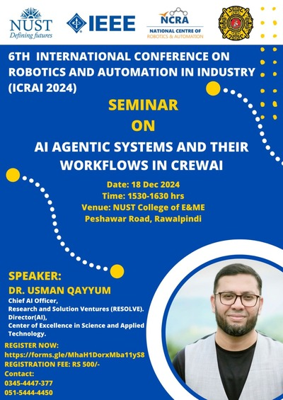

# Agentic AI Systems (Hands on with CREWAI Framework)

Welcome to the official repository for the **Agentic AI Systems** seminar. 

---

## **Overview**

This seminar explores the latest advancements in multi-agent systems, artificial intelligence workflows, and their applications using <a href='https://www.crewai.com/' > CREWAI</a>. Below are the descriptions and key takeaways for each session. You can use colab directly with github by visiting following link
- **Colab Github:** `Colab with github`   
 

---

## **Sessions**

### 1. **Query to Large Language Models (LLMs)**  
- **Notebook:** `L1_LLM.ipynb`   
- **Takeaways:**  
  - Understand the Q/A mechanism to LLMs.  
  - LLMs are the brain of Agentic system and this learning will be used in the upcoming sessions for agents collaboration and problem-solving.  

---

### 2. **Understanding Single-Agent Environments**  
- **Notebook:** `L2_SingleAgent.ipynb`   
- **Takeaways:**  
  - Grasp the core principles of Crewai framework with single agent.  
  - Learn how single-agent solutions set the stage for complex multi-agent workflows. 
  - AI agent is given a task of writting a blog for the topic provided by the user 

---

### 3. **Tools and Techniques for Single-Agent Optimization**  
- **Notebook:** `L3_SingleAgent_tool.ipynb`    
- **Takeaways:**  
  - Discover Search tools and techniques applicable to single-agent systems. 
  - Learn how single-agent uses the tool to search the internet and utlize the information while answering   

---

### 4. **Writing Research Papers on Multi-Agent Systems**  
- **Notebook:** `L4_research_write.ipynb`    
- **Takeaways:**  
  - Learn how to program multi agents and tasks for multi-agent systems.  
  - Three agents (planner, editor, writter) with three different tasks to perform content writing.  

---

### 5. **Agent Delegation and Memory in Multi-Agent Systems**  
- **Notebook:** `L5_agent_delegation_mem.ipynb`    
- **Takeaways:**  
  - Understand agent delegation and memory using technique along with tools for agentic system.  
  - Learn how multiagents delegate the task while solving the query and use tool
  - Learn the input provided by the user as json format

---

### 6. **Hierarchical Structures in Financial Multi-Agent Systems**  
- **Notebook:** `L6_hierarchical_finanical.ipynb`    
- **Takeaways:**  
  - Gain insights into hierarchical approaches to multi-agent systems.  
  - Understand how these structures are applied to financial automation and decision-making.
  - The crew uses the tools (serper and ScrapeWebsite), delegate task among the agents, uses the hierarchical implementation of the agents.   

---

## **Seminar Details**
This repository provides resources, tutorials, and workflows used in the seminar conducted during the 6th International Conference on Robotics and Automation in Industry (ICRAI 2024).

- **Date:** December 18, 2024  
- **Time:** 1530–1630 hrs  
- **Venue:** NUST College of E&ME, Peshawar Road, Rawalpindi  

### **Speaker**  
Dr. Usman Qayyum  
- Chief AI Officer, Research and Solution Ventures (Resolve)  

**Register Link:** [Registration Form](https://forms.gle/MhaH1DorxMba11yS8)

---

## **License**

This project is licensed under the GPL-3.0 License.

---

